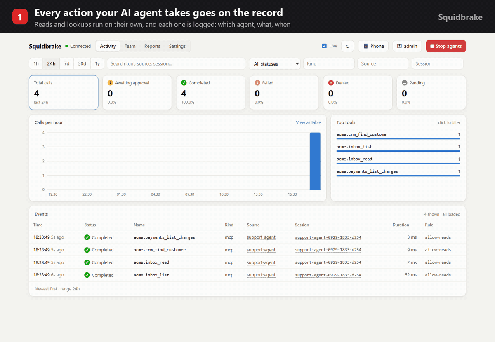

# Squidbrake

[](https://github.com/batrapulkit/squidbrake/actions/workflows/tests.yml)
[](LICENSE)
[](requirements.txt)
[](#2-connect-real-agents)



**Brakes for your AI agents.** Every action an agent takes (running a command, editing a file, sending an
email, issuing a refund, changing a database) goes through Squidbrake first. It is **checked** against your
rules, **held for a person** when it's risky, **recorded** in a tamper-evident audit trail, and can be
**stopped** instantly.

Free and open source (Apache 2.0). Runs on your laptop or your own server; your data never leaves it.

- **Rules, not vibes:** `rules.yaml` says what runs by itself, what's blocked, and what waits for a person.
  No LLM in the decision path.
- **Human approval:** risky actions wait in the dashboard, on your phone (one-tap links, push via ntfy) or in Slack.
  The approver sees *what led to it*, e.g. the email the agent just read.
- **Judges by history:** blocks a retry of something a person rejected, catches look-alike domains
  (`acrne-corp.com` pretending to be `acme.com`), flags duplicate refunds.
- **Works with real agents:** one command connects Claude Code (every tool call, via hooks), and any MCP app
  (Stripe, GitHub, Slack, databases, internal tools) can be wrapped for Antigravity, Cursor, Claude Desktop and others.
- **For teams:** a key per person and per agent, roles (only `finance` approves wires), an emergency stop,
  reports, CSV export and an audit trail you can verify.
- **Fails closed:** if Squidbrake is down, guarded tools don't run.

See [SHOWCASE.md](SHOWCASE.md) for a 5-minute demo with a sandbox company.


<table><tr>
<td width="62%"><br>
<sub>An agent read an "urgent CEO" email from <code>acrne-corp.com</code> and tried to wire $24,800. Blocked, with the story of what led to it.</sub></td>
<td width="38%"><br>
<sub>Approve or reject from your phone with one tap.</sub></td>
</tr></table>

## See it live, nothing to install

[](https://codespaces.new/batrapulkit/squidbrake?quickstart=1)

Click the button and the live demo starts in your browser (free with a GitHub account): a sandbox company's AI
support agent works its inbox while you watch. A scam wire is blocked, refunds wait for a person, and a demo
manager approves or rejects them. On your own machine: `pip install -r requirements.txt` then `python demo/live_demo.py`.

## Try it in 30 seconds

```bash
git clone https://github.com/batrapulkit/squidbrake && cd squidbrake
./start.sh          # Windows: start.bat
```

It installs itself, prints your keys and opens the dashboard. Then connect Claude Code (every tool call goes
through Squidbrake from then on):

```bash
./connect.sh claude-code          # Windows: connect.bat claude-code
```

Or with Docker: `docker run -d -p 8080:8080 -v squidbrake-data:/app/data --name squidbrake ghcr.io/batrapulkit/squidbrake`
(keys: `docker logs squidbrake`).

## 1. Start it

| Where | Command |
|---|---|
| Windows | double-click `start.bat` |
| macOS / Linux | `./start.sh` |
| A Linux server, 24/7 | `./install.sh` (or `./install.sh gateway.yourdomain.com` for HTTPS) |

The first start installs everything, prints an **admin** key (for the dashboard) and an **agent** key
(shown once, so save them), and opens `http://localhost:8080/dashboard`. No configuration needed; every
setting in `.env.example` is optional.

Keys: `python server.py add-key NAME [--approver]`, `python server.py remove-key NAME`, `python server.py keys`.
Changes apply immediately, no restart needed. (Inside Docker, prefix with `docker compose exec gateway`.)

## 2. Connect real agents

With the gateway running, one command per agent (use the `.venv` Python that `start.bat` / `start.sh` created):

```bash
.venv/Scripts/python connect.py claude-code          # Windows (macOS/Linux: .venv/bin/python)
.venv/Scripts/python connect.py mcp --name antigravity   # also: claude-desktop, cursor
```

- **Claude Code**: a hook sends *every* tool call (Bash, PowerShell, Edit, Write, Read, WebFetch, MCP tools)
  through the gateway before it runs. Blocked calls are refused with the reason, and calls held for
  approval wait until you decide in the dashboard. It also adds the database tools below.
  Add `--project DIR` to limit it to one project; `--remove` undoes it. If the gateway is down, Claude Code's
  tool calls are blocked (fail closed) and it says why.
- **Antigravity, Claude Desktop, Cursor, any MCP client**: prints the config block to paste in. The agent
  gets `list_tables`, `describe_table`, `query` and `execute` tools on a SQLite database
  (`data/shop.db`, created with sample customers / products / orders; set `DB_PATH` to use your own).
  Reads run immediately, `UPDATE`/`DELETE`/`INSERT`/`ALTER` wait for your approval, and `DROP`/`TRUNCATE` are blocked.

Things to ask the agent, then watch the dashboard:

- "Show me the top 5 customers by revenue" (runs)
- "Give every customer on the team plan a 15% discount" (waits for you to approve)
- "Delete all failed orders" (approve or reject it; a rejection note is passed back to the agent)
- "Drop the orders table" (blocked)
- In Claude Code: "commit and push this" (the `git push` waits for approval)

## 3. Show it to someone

- **Right now, from your PC:** `cloudflared tunnel --url http://localhost:8080` prints a public
  `https://….trycloudflare.com` link. Give viewers their own key: `python server.py add-key guest`.
  Afterwards, press Ctrl+C and run `python server.py remove-key guest`.
- **Permanently:** `./install.sh gateway.yourdomain.com` on a small cloud server.

## 4. Other computers (a friend, a teammate, a server)

Make a clean copy (no keys, no history): `python pack.py` -> `dist/squidbrake.zip`.

- **Their own gateway:** unzip, double-click `start.bat` (Windows) or run `./start.sh`. It makes its own keys.
- **Their agents on YOUR gateway:** in your dashboard's **Team** tab add them (a person, to watch/approve) and add
  their agent (type *AI agent*); send them that agent key. They unzip and run, for example:
  `connect.bat wrap --sandbox --agent claude-code --url https://your-gateway --key gw_...`
  (or `connect.bat claude-code --url ... --key ...` to route every Claude Code action through your gateway).
- **A cloud server, 24/7:** unzip there and run `bash install.sh` (HTTPS included, no domain needed).

## Other ways to send calls through it

**Python** - wrap your tools:

```python
from client import Gateway, Denied
gw = Gateway("https://gateway.example.com", api_key="...", source="my-agent", session_id=run_id)

@gw.guard(name="shell.exec")
def shell_exec(command: str): ...
```

**Any language** - two HTTP calls (header `X-Gateway-Key: <secret>`):

```
POST /v1/events               {"name": "shell.exec", "input": {...}, "source": "...", "session_id": "..."}
  -> {"event_id": "...", "decision": "allow" | "deny", "reason": "...", "rule_id": ...}
POST /v1/events/{id}/result   {"output": ..., "error": null, "duration_ms": 12}
```

Record an action that already happened in one call by including `output`/`error` in the first POST.

**HTTP proxy** - no code changes: define `upstreams` in `rules.yaml`, then point the client at
`http://gateway:8080/proxy/<upstream>/...`. Optional headers: `X-Gateway-Source`, `X-Gateway-Session`.
Denied requests get `403`; every response carries `X-Gateway-Event-Id`.

## Human approval

Rules with `action: review` hold the call until a person approves or rejects it:

```yaml
- id: approve-payments
  action: review
  reason: Money movement needs a human
  timeout_seconds: 600     # default APPROVAL_TIMEOUT (300)
  on_timeout: deny         # or allow
  approvers: [alice, bob]  # optional; default = any approver key
  match: { name: "payments.*" }
```

- The first `POST /v1/events` returns `"decision": "review"`. **The Python client handles this for
  you**: `check()` and `@gw.guard` block until the call is decided, then run the tool or raise `Denied`.
  Other clients long-poll `GET /v1/events/{id}/decision?wait=25` until `decision` is `allow` or `deny`.
- To decide, use the **Needs approval** queue at the top of the dashboard, or call
  `POST /v1/events/{id}/approve` / `.../reject` with an optional `{"note": "..."}`.
- Only approver keys (`python server.py add-key NAME --approver`, and the rule's `approvers` if set) can decide,
  and **a key can never approve its own request**. So give people their own keys, separate from the agents' keys.
- If nobody decides before the deadline, `on_timeout` applies and `decided_by` is recorded as `timeout`.
- Every decision is stored on the event with who decided, when, and their note.
- Set `APPROVAL_WEBHOOK_URL` (plus `PUBLIC_URL`) to get a Slack-style message with a link to the event
  whenever something needs approval.
- Through the HTTP proxy, a held request stays open until it's decided, so the caller's HTTP
  timeout must be longer than the rule's `timeout_seconds`.

## Dashboard

Open `http://<host>:8080/dashboard` and paste your admin key (or any key made with `add-key`). It is stored
only in that browser. The page shows:

- totals per status (click a tile to filter), a calls-per-hour/day chart (hover for counts,
  click a bar to list just that hour, "View as table" for exact numbers), and the top tools
- the event list, updated every 5 s while "Live" is on. Filter by time range, search, status,
  kind, source or session. Click a source or session to filter by it. "Load older" pages back.
- the full record for any event: input, output, error, metadata, the rule that blocked it, timings
- filters are kept in the URL, so a view like `/dashboard?status=denied&range=7d` can be bookmarked or shared

## FAQ

### How is Squidbrake different from Claude Code's built-in allow/ask permissions?

Claude Code's built-in permissions control actions for an individual agent. Squidbrake provides **centralized rules for a whole team**, with approvals from your **phone or Slack**, history checks, an **audit trail**, and support across multiple agents.

### What happens if Squidbrake is down?

Squidbrake **fails closed**. Guarded tool calls are blocked if the gateway is unreachable, rather than being allowed through.

### Does my data leave my machine?

No. Squidbrake is **self-hosted** and runs on your laptop or your own server. Your data stays in your environment.

### Does Squidbrake use an LLM to make decisions?

No. Squidbrake uses **deterministic rules and checks**. There is no LLM in the decision path.

### Can an agent get around Squidbrake?

An agent cannot bypass Squidbrake through tools that are connected to the gateway. An agent could still use a tool that **isn't connected to Squidbrake**. See [`SECURITY.md`](SECURITY.md) for the security model and limitations.

## Querying

| Endpoint | |
|---|---|
| `GET /v1/events?q=&session_id=&source=&client=&kind=&name=&status=&since=&before=&limit=` | newest first, page with `before=<next_before>` |
| `GET /v1/events/{id}` | one event |
| `GET /v1/events/{id}/decision?wait=25` | current decision; long-polls while awaiting approval |
| `POST /v1/events/{id}/approve` · `/reject` | human decision, body `{"note": "..."}` (approver keys only) |
| `GET /v1/me` | which key you are and whether it can approve |
| `GET /v1/stats?hours=24&bucket=hour` | counts by status, top tool names, timeline (same filters as events) |
| `POST /v1/policy/check` | dry-run a call against the rules (not recorded) |
| `GET /docs` | interactive OpenAPI docs |

## Behaviour notes

- **Fail closed**: the Python client refuses to run a tool if the gateway is unreachable
  (`fail_open=True` to change that).
- **Rules hot-reload** on file save; a broken edit is logged and the last good rules stay active.
- **Audit records are write-once**: a result can be posted once, never for a denied call, and never
  while the call is still awaiting approval. Each approval can be decided only once. If two approvers
  click at the same moment, only the first decision counts.
- **Upgrades**: new columns are added to an existing database automatically at startup.
- **Redaction**: keys like `password`, `token`, `api_key`, `authorization`, `cookie` and values like
  `Bearer ...`, `sk-...`, `ghp_...` are stored as `[REDACTED]`. Rules still see the raw input.
- Payloads over `MAX_PAYLOAD_CHARS` are truncated in storage. Proxy responses are buffered (no streaming/SSE).
- SQLite (WAL) is fine for one machine. For several gateway replicas, set `DATABASE_URL` to Postgres.

## Tests

```bash
pip install pytest && pytest -q
python tests/e2e_business_scenario.py
```

## Contributing, security, license

- [CONTRIBUTING.md](CONTRIBUTING.md): setup and guidelines
- [SECURITY.md](SECURITY.md): report vulnerabilities privately
- Licensed under the [Apache License 2.0](LICENSE)
